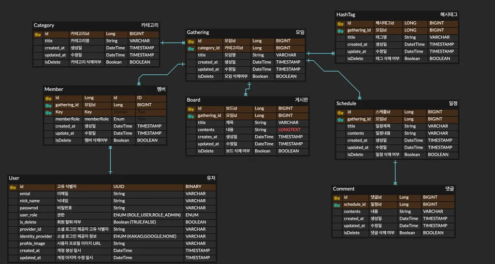
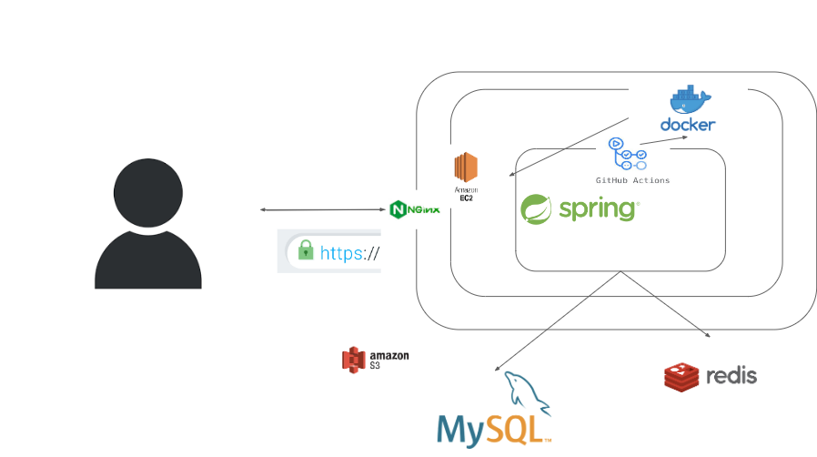
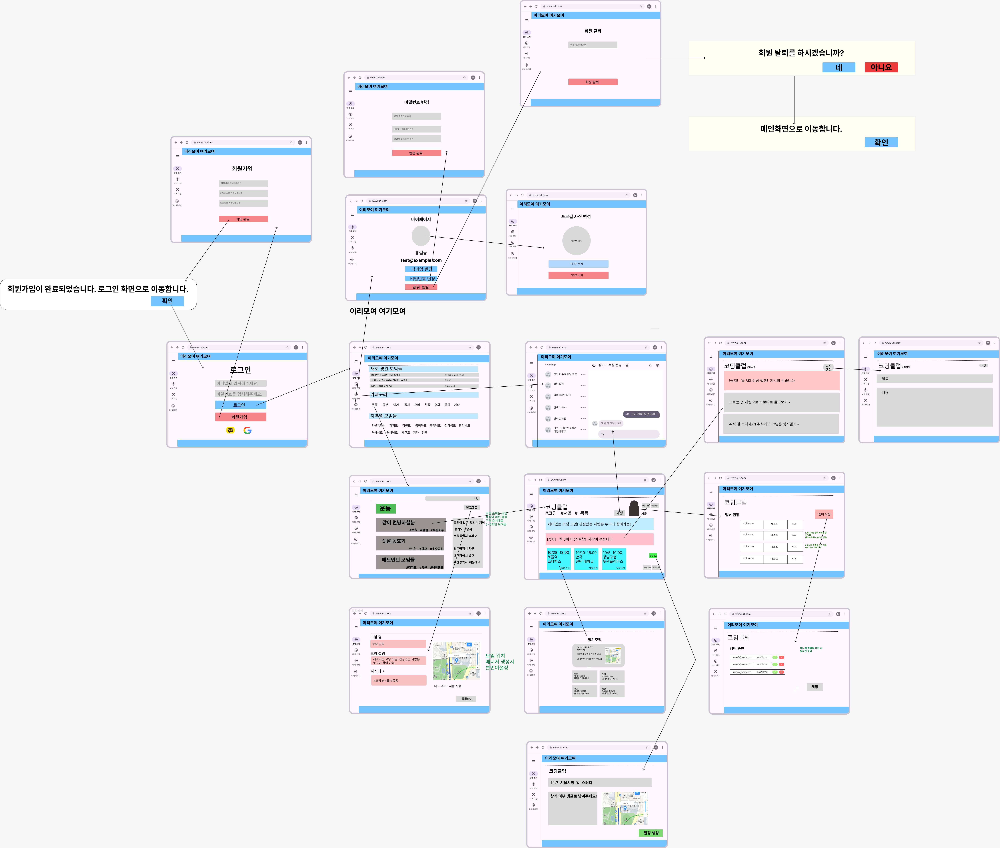

# 🎨 취미 모임 관리 앱
​
같은 취미를 가진 사람들과 모임을 쉽게 만들고 관리할 수 있는 앱입니다. 사용자는 모임을 생성하고, 멤버를 관리하며, 실시간 소통과 일정 관리를 할 수 있습니다.
​
---
## 📑 목차
-   [개요](#%EA%B0%9C%EC%9A%94)
-   [배경](#%EB%B0%B0%EA%B2%BD)
-   [SWAGGER 사용법](#%EB%B0%B0%EA%B2%BD)
-   [API명세서](#%EB%B0%B0%EA%B2%BD)
-   [ERD](#%EB%B0%B0%EA%B2%BD)
-   [인프라설계도](#%EB%B0%B0%EA%B2%BD)
-   [와이어프레임](#%EB%B0%B0%EA%B2%BD)
-   [핵심 기능](#%ED%95%B5%EC%8B%AC-%EA%B8%B0%EB%8A%A5)
-   [추가 기능](#%EC%B6%94%EA%B0%80-%EA%B8%B0%EB%8A%A5)
-   [기술 사양](#%EA%B8%B0%EC%88%A0-%EC%82%AC%EC%96%91)
-   [적용 기술](#%EC%A0%81%EC%9A%A9%EA%B8%B0%EC%88%A0)
-   [트러블 슈팅](#%ED%8A%B8%EB%9F%AC%EB%B8%94-%EC%8A%88%ED%8C%85)
    ​
---
### 🔍 개요
​
이 앱은 취미를 중심으로 모임을 쉽게 생성하고 관리할 수 있는 플랫폼입니다. 사용자는 다음과 같은 기능을 이용할 수 있습니다:
​
-   **모임 정보 입력**
-   **회원 모집**
-   **실시간 소통**
-   **일정 및 모임 관리**
    ​
### 🌟 배경
​
사람들의 관심사가 다양해지면서 비슷한 관심을 가진 사람들과 경험을 공유하려는 욕구가 커지고 있습니다. 하지만 취미 모임을 직접 조직하고 관리하는 일은 홍보, 소통, 일정 관리 등 여러 면에서 어려움을 겪을 수 있습니다. 이 앱은 이러한 과정을 간소화하는 데 목적이 있습니다.
​
---
### SWAGGER 사용법

---
### ⚙️ 핵심 기능
1.  **🔐 회원가입 및 로그인**
    -   **이메일 회원가입**: 이메일을 통해 회원가입
    -   **카카오 회원가입**: 카카오를 통한 회원가입
    -   **로그인**: 이메일 또는 카카오를 통한 로그인
    -   **회원 탈퇴**: 비밀번호 입력 후 소프트 딜리트
2.  **👤 프로필 관리 (CUD)**
    -   프로필 정보 조회 (이미지, 닉네임)
    -   프로필 이미지 등록
    -   프로필 이미지 및 닉네임 변경
3.  **🎉 모임 관리 (CRUD)**
    -   **생성, 수정, 삭제**: 소규모 취미 모임 생성 및 수정, 삭제
    -   **카테고리별 조회**: 선택한 카테고리별로 모임 조회
    -   **해시태그 조회**: 해시태그를 통해 모임 검색
4.  **📝 공지(게시판) 관리 (CUD)**
    -   게시판에서 공지 작성, 수정, 삭제
5.  **💬 댓글 관리 (CUD)**
    -   게시글에 댓글 작성, 수정, 삭제
6.  **🏷️ 해시태그 (CD)**
    -   콘텐츠를 분류할 수 있는 태그 생성 및 삭제
        ​
---
### 🚀 추가 기능
-   **💬 모임 내 단체 채팅**: WebSocket/STOMP을 통한 실시간 단체 채팅
-   **📎 이미지 첨부**: AWS S3를 통해 이미지 업로드
-   **❤️ 모임 랭킹**: 캐시 기반 랭킹 시스템
-   **🗺️ 지도 확인**: 지도로 해당 일정의 장소 확인
    ​
---
### [API 명세서](https://www.notion.so/teamsparta/21-5f3e6a5d16e84de48916ea9904b4fc91)

### 유저

| Method | Endpoint | Description | Authorization | Request Body | Response |
|--------|----------|-------------|---------------|--------------|----------|
| POST   | `/api/users/signup` | 회원가입 | None | `{ "email": "test@example.com", "nickName": "홍길동", "password": "password123!A", "identityProvider": "NONE" }` | `{ "statusCode": 200, "message": "회원가입이 완료되었습니다. 로그인 화면으로 이동합니다.", "data": null }` |
| POST   | `/api/auth/login` | 로그인 | None | `{ "email": "test@example.com", "password": "password123!A" }` | `Authorization: Bearer <Token>` |
| PATCH  | `/api/users/me/delete` | 회원 탈퇴 | Bearer Token | None | `{ "statusCode": 200, "message": "회원 탈퇴가 완료되었습니다. 이용해 주셔서 감사합니다.", "data": null }` |
| PATCH  | `/api/users/me/password` | 비밀번호 변경 | Bearer Token | `{ "oldPassword": "password123!A", "newPassword": "password456@B" }` | `{ "statusCode": 200, "message": "비밀번호 변경이 성공적으로 완료되었습니다.", "data": null }` |
| PATCH  | `/api/users/me/nickname` | 닉네임 변경 | Bearer Token | `{ "newNickName": "김길동" }` | `{ "statusCode": 200, "message": "닉네임 변경이 성공적으로 완료되었습니다.", "data": null }` |
| GET    | `/api/users/me/profile` | 본인 프로필 조회 | Bearer Token | None | `{ "statusCode": 200, "message": "프로필 조회가 성공적으로 완료되었습니다.", "data": { "id": "10520c8d-ac1f-4a40-8bc0-70e42854a532", "email": "test@example.com", "nickName": "홍길동", "profileImage": "https://…주소" } }` |

---

### 댓글

| Method | Endpoint | Description | Authorization | Request Body | Response |
|--------|----------|-------------|---------------|--------------|----------|
| POST   | `/api/schedule/{scheduleId}/comments` | 댓글 생성 | Bearer Token | `{ "comment": "댓글 내용" }` | - |
| PATCH  | `/api/comments/{commentId}` | 댓글 수정 | Bearer Token | `{ "comment": "댓글 내용" }` | - |
| DELETE | `/api/comments/{commentId}` | 댓글 삭제 | Bearer Token | None | - |
| GET    | `/api/comment/` | 댓글 조회 | None | None | - |

---

### 공지(게시판)

| Method | Endpoint | Description | Authorization | Request Body | Response |
|--------|----------|-------------|---------------|--------------|----------|
| POST   | `/api/{gatheringsId}/boards` | 보드 생성 | Bearer Token | `{ "title": "제목", "contents": "내용" }` | - |
| PATCH  | `/api/{gatheringsId}/boards/{boardsId}` | 보드 수정 | Bearer Token | `{ "boardsId": "id", "title": "제목", "contents": "내용" }` | - |
| DELETE | `/api/{gatheringsId}/boards/{boardsId}` | 보드 삭제 | Bearer Token | `{ "boardsId": "id", "isDeleted": true }` | - |

---

### 일정

| Method | Endpoint | Description | Authorization | Request Body | Response |
|--------|----------|-------------|---------------|--------------|----------|
| POST   | `/api/{gatheringsId}/schedules` | 일정 생성 | Bearer Token | `{ "title": "제목", "contents": "내용" }` | - |
| PATCH  | `/api/{gatheringsId}/schedules/{schedulesId}` | 일정 수정 | Bearer Token | `{ "schedulesId": "id", "title": "제목", "contents": "내용" }` | - |
| DELETE | `/api/{gatheringsId}/schedules/{schedulesId}` | 일정 삭제 | Bearer Token | `{ "schedulesId": "id", "isDeleted": true }` | - |

---

### 모임

| Method | Endpoint | Description | Authorization | Request Body | Response |
|--------|----------|-------------|---------------|--------------|----------|
| POST   | `/api/gathers` | 모임 생성 | Bearer Token | `{ "title": "모임1" }` | - |
| GET    | `/api/gathers` | 모임 보기 | Bearer Token | None | `[ { "title": "모임1" }, { "title": "모임2" }, ... ]` |
| PATCH  | `/api/gathers/{gatherId}` | 모임 내용 수정 | Bearer Token | `{ "title": "모임1 수정" }` | - |
| DELETE | `/api/gathers/{gatherId}` | 모임 삭제 | Bearer Token | None | - |

---

### 멤버

| Method | Endpoint | Description | Authorization | Request Body | Response |
|--------|----------|-------------|---------------|--------------|----------|
| GET    | `/api/members/{gatherId}` | 멤버 조회 | Bearer Token | None | - |
| POST   | `/api/member/{userId}/{gatherId}` | 멤버 가입 신청 | Bearer Token | None | - |
| PATCH  | `/api/member/{memberId}/{gatherId}` | 멤버 가입 승인 | Bearer Token | None | - |
| PATCH  | `/api/members/{memberId}/{gatherId}` | 멤버 가입 거절 | Bearer Token | None | - |
| DELETE | `/api/members/{memberId}` | 멤버 탈퇴 | Bearer Token | None | - |

---

### 카테고리

| Method | Endpoint | Description | Authorization | Request Body | Response |
|--------|----------|-------------|---------------|--------------|----------|
| POST   | `/api/categories` | 카테고리 생성 | Bearer Token | `{ "categoryName": "운동" }` | - |
| GET    | `/api/categories` | 카테고리 조회 | None | None | `[ { "categoryId": "", "categoryName": "" }, { "categoryId": "", "categoryName": "" } ]` |
| PATCH  | `/api/categories/{categoryId}` | 카테고리 수정 | Bearer Token | `{ "categoryName": "운동" }` | - |
| DELETE | `/api/categories/{categoryId}` | 카테고리 삭제 | Bearer Token | None | - |

---

### 해시태그

| Method | Endpoint | Description | Authorization | Request Body | Response |
|--------|----------|-------------|---------------|--------------|----------|
| POST   | `/api/gatherings/{gatheringId}/hashtags` | 해시태그 생성 | Bearer Token | `{ "hashTagName": "풋살" }` | - |
| GET    | `/api/gathering/{gatheringId}/hashtags` | 해시태그 조회 | Bearer Token | None | `{ "gatherId": "", "hashTag": [ { "hashTagId": "", "hashTagName": "" }, { "hashTagId": "", "hashTagName": "" } ] }` |
| DELETE | `/api/gathering/{gatheringId}/hashtags/{hashtagId}` | 해시태그 삭제 | Bearer Token | None | - |

---

### 프로필 이미지 

| Method | Endpoint | Description | Authorization | Request Body | Response |
|--------|----------|-------------|---------------|--------------|----------|
| PATCH  | `/api/user/{userId}/profile-image` | 이미지 수정 | Bearer Token | file | - |
| GET    | `/api/user/{userId}/profile-image` | 이미지 조회 | Bearer Token | None | - |
| DELETE | `/api/user/{userId}/profile-image` | 이미지 삭제 | Bearer Token | None | - |

---
### [ERD](https://www.notion.so/teamsparta/21-5f3e6a5d16e84de48916ea9904b4fc91)

---
### [인프라 설계도](https://www.notion.so/teamsparta/21-5f3e6a5d16e84de48916ea9904b4fc91)

---
### [와이어프레임](https://www.notion.so/teamsparta/21-5f3e6a5d16e84de48916ea9904b4fc91)

---

### 🛠️ 기술 사양
-   **백엔드**  
        
-   **프론트엔드**  
    
-   **데이터베이스**  
    
-   **호스팅**  
    
-   **인증**  
    
-   **실시간 통신**
-   **파일 저장**  
    
-   **캐싱**  
    
-   **소셜**  
     
-   **배포**  
    
    ​
---
### 적용 기술

---
### 트러블 슈팅